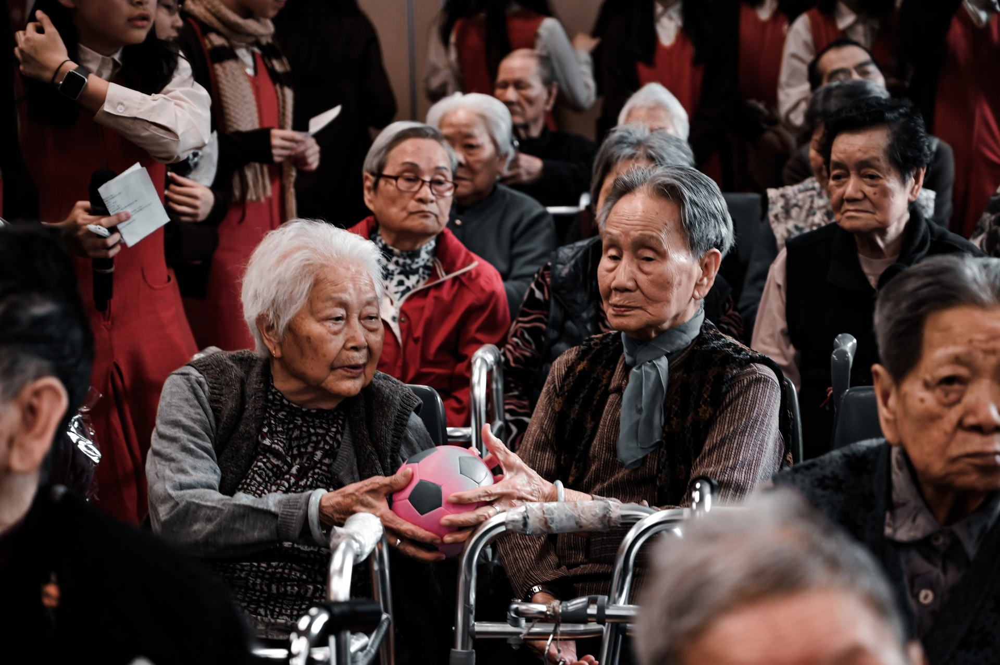

<!DOCTYPE html>
<html lang="en">
<head>
    <meta charset="UTF-8">
    <meta http-equiv="X-UA-Compatible" content="IE=edge">
    <meta name="viewport" content="width=device-width, initial-scale=1.0">
    <title>Charity</title>
    <link rel="stylesheet" href="style.css"/>
    <link rel="stylesheet" href="https://use.fontawesome.com/releases/v5.15.4/css/all.css" integrity="sha384-DyZ88mC6Up2uqS4h/KRgHuoeGwBcD4Ng9SiP4dIRy0EXTlnuz47vAwmeGwVChigm" crossorigin="anonymous"/>
</head>
<body>
    <!-- Navbar section -->
    <nav class="navbar">
        <a href="/" class="navbar__logo">Charity</a>
        

            
            
            
        

        

            <a href="/index.html" class="navbar__link">home</a>
            <a href="/charityfunds.html" class="navbar__link">charity funds</a>
            <a href="/additionalfunds.html" class="navbar__link">additional funds</a>
            <a href="/results.html" class="navbar__link">results</a>
            <a href="/needvolunteers.html" class="navbar__link">need volunteers</a>
            <a href="/worldwidedonaters.html" class="navbar__link">worldwide funds</a>
            <a href="/contacts.html" class="navbar__link">contacts</a>
        

    </nav>
    <!--Hero section-->
    

        

            <h1>Main page</h1>
            
some useful info

            <a href="/" class="button">Get started</a>
        

    

    <!--services section-->
    

        

            

                
Features

                <h1 class="services__heading">What we offer</h1>
                

                    
Volunteering

                    
Volunteering

                    
Volunteering

                    
Volunteering

                

            

            

                
            

        

    

    
</body>
</html>
